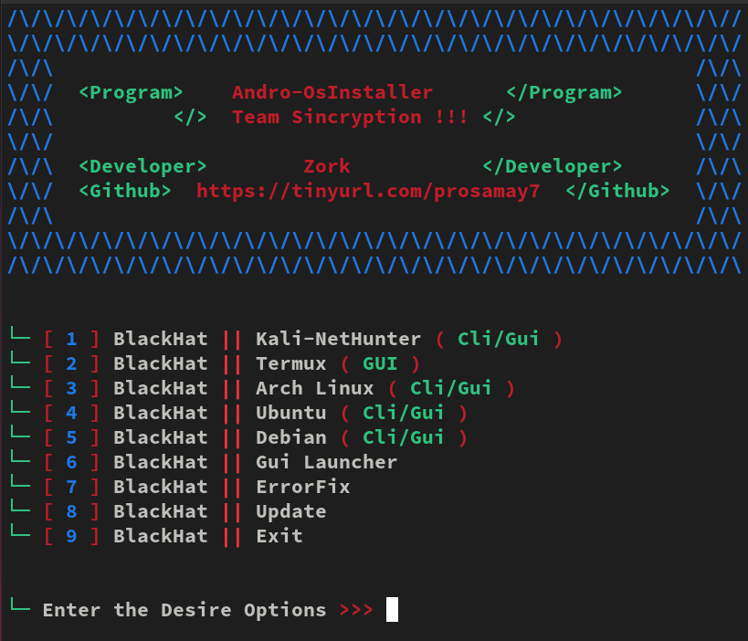

<h1 align="center">Andro-OsInstaller<br>
</h1>

* `📱 💀`<br />
* `A Andro-OsInstaller for termux `

## Disclaimer
*This tool is for educational purposes only !*
_Don't use this to take revenge_<br />
*I will not be responsible for any misuse*

## About
* `Unlimited Testings`
* `Cross Platform`
* `Supports newest Android also`
* `No balance will be deducted `
* `Working Apis`
* `No missing Api issues,`
* `Working with all Operators/Carriers`

## Tested On :
<ul>
 
  <li>Android 10+ Termux</li>
 
  
</ul>

## Termux Issue:
* `Termux App is no longer recieving updates on playstore`
* `due to recently introduced Google Play policy `
<br>

DON'T WORRY
* `We have a solution for that !`
<br>


You can download the latest termux app and install it

From here <a href="https://f-droid.org/repo/com.termux_118.apk">Link</a>

## Usage


#### For Termux

Script Installation One-Line Command
```bash
apt update && apt upgrade && pkg update && pkg upgrade && rm -rf Andro-OsInstaller && pkg install git && git clone https://github.com/samay825/Andro-OsInstaller && cd Andro-OsInstaller && pkg install python && python3 main.py
```

#### type bash sound in other terminal 
#### type termux-x11 :1 

Then For Kali-NetHunter After nh command
```bash
sudo apt update && apt install python3-pip && sudo apt install git && git clone https://github.com/samay825/Andro-OsInstaller && cd Andro-OsInstaller && python3 main.py
```
Now you can launch the GUI Launcher


## Version
* `Andro-OsInstaller v1.0`

## Features
* `Install Any os without errors in Android`

* `Os Like Kali-Nethunter , Termux -GUI , Arch-Linux , Ubuntu , Debian`

* `No Errors All solved in script `

## Credits & Special Thanks
* `Youtube channel : GSM THE WORK`
* `Termux-GUI creator : adi1090x`

## Licence
Apache 2.0 © Samay825


## Contact Us
* `If you have any feedback or queries`
* `Instagram: @sincryptzork`
* `Telegram: @sincryptzork`

## Telegram Channel

* `All updates of Team Sincryption will be posted here !`

<a href="https://t.me/TeamSincryption">
         
